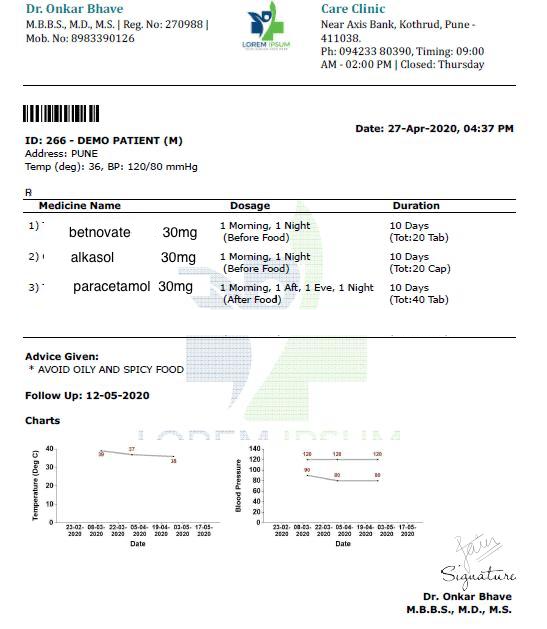

# OCR-based Medicine Name Extractor API

This is a Flask-based API for extracting medicine names from images using Optical Character Recognition (OCR) and regular expressions. The API uses **Tesseract OCR** to extract text from uploaded images and identifies medicine names based on predefined patterns.

---

## Features

- Extracts medicine names and formats (e.g., "Paracetamol 500 mg", "Amoxicillin syrup") from images.
- RESTful API with a simple endpoint.
- CORS enabled for cross-origin requests.

---

## Getting Started

### Prerequisites

1. Python 3.x
2. Flask
3. Tesseract OCR
4. Required Python libraries (see `requirements.txt`):
   - Flask
   - Flask-CORS
   - Pillow
   - pytesseract

---

### Installation

1. Clone the repository:
   ```bash
   git clone https://github.com/your-username/ocr-medicine-api.git
   cd ocr-medicine-api
   ```

2. Install Dependencies:
  ```bash
  pip install -r requirements.txt
  ```
3. Ensure Tesseract OCR is installed on your system and accessible. For linux:
  ```bash
  sudo apt update
  sudo apt install tesseract-ocr
  ```
4. Run the Flask app locally:
  ```bash
  python app.py
  ```

### Screenshots

> Sample Prescription  


> Postman  

